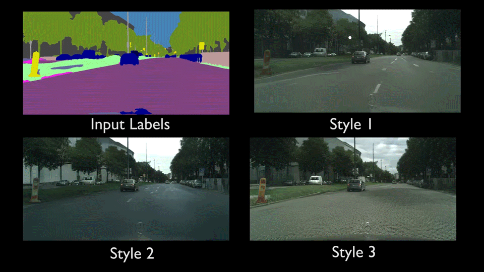

<br><br><br><br>

# vid2vid
### [Project](https://tcwang0509.github.io/vid2vid/) | [YouTube(short)](https://youtu.be/5zlcXTCpQqM) | [YouTube(full)](https://youtu.be/GrP_aOSXt5U) | [arXiv](https://arxiv.org/abs/1808.06601) | [Paper(full)](https://tcwang0509.github.io/vid2vid/paper_vid2vid.pdf)

Pytorch implementation for high-resolution (e.g., 2048x1024) photorealistic video-to-video translation. It can be used for turning semantic label maps into photo-realistic videos, synthesizing people talking from edge maps, or generating human motions from poses. The core of video-to-video translation is image-to-image translation. Some of our work in that space can be found in [pix2pixHD](https://github.com/NVIDIA/pix2pixHD) and [SPADE](https://github.com/NVlabs/SPADE). <br><br>
[Video-to-Video Synthesis](https://tcwang0509.github.io/vid2vid/)  
 [Ting-Chun Wang](https://tcwang0509.github.io/)<sup>1</sup>, [Ming-Yu Liu](http://mingyuliu.net/)<sup>1</sup>, [Jun-Yan Zhu](http://people.csail.mit.edu/junyanz/)<sup>2</sup>, [Guilin Liu](https://liuguilin1225.github.io/)<sup>1</sup>, Andrew Tao<sup>1</sup>, [Jan Kautz](http://jankautz.com/)<sup>1</sup>, [Bryan Catanzaro](http://catanzaro.name/)<sup>1</sup>  
 <sup>1</sup>NVIDIA Corporation, <sup>2</sup>MIT CSAIL  
 In Neural Information Processing Systems (**NeurIPS**) 2018  

## Video-to-Video Translation
- Label-to-Streetview Results
<p align='center'>  
    
  
</p>

- Edge-to-Face Results
<p align='center'>
  
  
</p>

- Pose-to-Body Results
<p align='center'>
  
</p>

- Frame Prediction Results
<p align='center'>
  
</p>

## Prerequisites
- Linux or macOS
- Python 3
- NVIDIA GPU + CUDA cuDNN
- PyTorch 0.4


## Getting Started
### Installation
- Install python libraries [dominate](https://github.com/Knio/dominate) and requests.
```bash
pip install dominate requests
```
- If you plan to train with face datasets, please install dlib.
```bash
pip install dlib
```
- If you plan to train with pose datasets, please install [DensePose](https://github.com/facebookresearch/DensePose) and/or [OpenPose](https://github.com/CMU-Perceptual-Computing-Lab/openpose).
- Clone this repo:
```bash
git clone https://github.com/NVIDIA/vid2vid
cd vid2vid
```
- Docker Image
If you have difficulty building the repo, a docker image can be found in the `docker` folder.

### Testing 
- Please first download example dataset by running `python scripts/download_datasets.py`.
- Next, download and compile a snapshot of [FlowNet2](https://github.com/NVIDIA/flownet2-pytorch) by running `python scripts/download_flownet2.py`.
- Cityscapes    
  - Please download the pre-trained Cityscapes model by:
    ```bash
    python scripts/street/download_models.py
    ```
  - To test the model (`bash ./scripts/street/test_2048.sh`):
    ```bash
    #!./scripts/street/test_2048.sh
    python test.py --name label2city_2048 --label_nc 35 --loadSize 2048 --n_scales_spatial 3 --use_instance --fg --use_single_G
    ```
    The test results will be saved in: `./results/label2city_2048/test_latest/`.

  - We also provide a smaller model trained with single GPU, which produces slightly worse performance at 1024 x 512 resolution.
    - Please download the model by
    ```bash
    python scripts/street/download_models_g1.py
    ```
    - To test the model (`bash ./scripts/street/test_g1_1024.sh`):
    ```bash
    #!./scripts/street/test_g1_1024.sh
    python test.py --name label2city_1024_g1 --label_nc 35 --loadSize 1024 --n_scales_spatial 3 --use_instance --fg --n_downsample_G 2 --use_single_G
    ```
  - You can find more example scripts in the `scripts/street/` directory.

- Faces
  - Please download the pre-trained model by:
    ```bash
    python scripts/face/download_models.py
    ```
  - To test the model (`bash ./scripts/face/test_512.sh`):
    ```bash
    #!./scripts/face/test_512.sh
    python test.py --name edge2face_512 --dataroot datasets/face/ --dataset_mode face --input_nc 15 --loadSize 512 --use_single_G
    ```
    The test results will be saved in: `./results/edge2face_512/test_latest/`.

### Dataset
- Cityscapes
  - We use the Cityscapes dataset as an example. To train a model on the full dataset, please download it from the [official website](https://www.cityscapes-dataset.com/) (registration required).
  - We apply a pre-trained segmentation algorithm to get the corresponding semantic maps (train_A) and instance maps (train_inst).
  - Please add the obtained images to the `datasets` folder in the same way the example images are provided.
- Face
  - We use the [FaceForensics](http://niessnerlab.org/projects/roessler2018faceforensics.html) dataset. We then use landmark detection to estimate the face keypoints, and interpolate them to get face edges.
- Pose
  - We use random dancing videos found on YouTube. We then apply DensePose / OpenPose to estimate the poses for each frame.

### Training with Cityscapes dataset
- First, download the FlowNet2 checkpoint file by running `python scripts/download_models_flownet2.py`.
- Training with 8 GPUs:
  - We adopt a coarse-to-fine approach, sequentially increasing the resolution from 512 x 256, 1024 x 512, to 2048 x 1024.
  - Train a model at 512 x 256 resolution (`bash ./scripts/street/train_512.sh`)
  ```bash
  #!./scripts/street/train_512.sh
  python train.py --name label2city_512 --label_nc 35 --gpu_ids 0,1,2,3,4,5,6,7 --n_gpus_gen 6 --n_frames_total 6 --use_instance --fg
  ```
  - Train a model at 1024 x 512 resolution (must train 512 x 256 first) (`bash ./scripts/street/train_1024.sh`):
  ```bash
  #!./scripts/street/train_1024.sh
  python train.py --name label2city_1024 --label_nc 35 --loadSize 1024 --n_scales_spatial 2 --num_D 3 --gpu_ids 0,1,2,3,4,5,6,7 --n_gpus_gen 4 --use_instance --fg --niter_step 2 --niter_fix_global 10 --load_pretrain checkpoints/label2city_512
  ```
If you have TensorFlow installed, you can see TensorBoard logs in `./checkpoints/label2city_1024/logs` by adding `--tf_log` to the training scripts.

- Training with a single GPU:
  - We trained our models using multiple GPUs. For convenience, we provide some sample training scripts (train_g1_XXX.sh) for single GPU users, up to 1024 x 512 resolution. Again a coarse-to-fine approach is adopted (256 x 128, 512 x 256, 1024 x 512). Performance is not guaranteed using these scripts.
  - For example, to train a 256 x 128 video with a single GPU (`bash ./scripts/street/train_g1_256.sh`)
  ```bash
  #!./scripts/street/train_g1_256.sh
  python train.py --name label2city_256_g1 --label_nc 35 --loadSize 256 --use_instance --fg --n_downsample_G 2 --num_D 1 --max_frames_per_gpu 6 --n_frames_total 6
  ```

- Training at full (2k x 1k) resolution
  - To train the images at full resolution (2048 x 1024) requires 8 GPUs with at least 24G memory (`bash ./scripts/street/train_2048.sh`). If only GPUs with 12G/16G memory are available, please use the script `./scripts/street/train_2048_crop.sh`, which will crop the images during training. Performance is not guaranteed with this script.

### Training with face datasets
- If you haven't, please first download example dataset by running `python scripts/download_datasets.py`.
- Run the following command to compute face landmarks for training dataset: 
  ```bash
  python data/face_landmark_detection.py train
  ```
- Run the example script (`bash ./scripts/face/train_512.sh`)
  ```bash
  python train.py --name edge2face_512 --dataroot datasets/face/ --dataset_mode face --input_nc 15 --loadSize 512 --num_D 3 --gpu_ids 0,1,2,3,4,5,6,7 --n_gpus_gen 6 --n_frames_total 12  
  ```
- For single GPU users, example scripts are in train_g1_XXX.sh. These scripts are not fully tested and please use at your own discretion. If you still hit out of memory errors, try reducing `max_frames_per_gpu`.
- More examples scripts can be found in `scripts/face/`.
- Please refer to [More Training/Test Details](https://github.com/NVIDIA/vid2vid#more-trainingtest-details) for more explanations about training flags.


### Training with pose datasets
- If you haven't, please first download example dataset by running `python scripts/download_datasets.py`.
- Example DensePose and OpenPose results are included. If you plan to use your own dataset, please generate these results and put them in the same way the example dataset is provided.
- Run the example script (`bash ./scripts/pose/train_256p.sh`)
  ```bash
  python train.py --name pose2body_256p --dataroot datasets/pose --dataset_mode pose --input_nc 6 --num_D 2 --resize_or_crop ScaleHeight_and_scaledCrop --loadSize 384 --fineSize 256 --gpu_ids 0,1,2,3,4,5,6,7 --batchSize 8 --max_frames_per_gpu 3 --no_first_img --n_frames_total 12 --max_t_step 4
  ```
- Again, for single GPU users, example scripts are in train_g1_XXX.sh. These scripts are not fully tested and please use at your own discretion. If you still hit out of memory errors, try reducing `max_frames_per_gpu`.
- More examples scripts can be found in `scripts/pose/`.
- Please refer to [More Training/Test Details](https://github.com/NVIDIA/vid2vid#more-trainingtest-details) for more explanations about training flags.

### Training with your own dataset
- If your input is a label map, please generate label maps which are one-channel whose pixel values correspond to the object labels (i.e. 0,1,...,N-1, where N is the number of labels). This is because we need to generate one-hot vectors from the label maps. Please use `--label_nc N` during both training and testing.
- If your input is not a label map, please specify `--input_nc N` where N is the number of input channels (The default is 3 for RGB images).
- The default setting for preprocessing is `scaleWidth`, which will scale the width of all training images to `opt.loadSize` (1024) while keeping the aspect ratio. If you want a different setting, please change it by using the `--resize_or_crop` option. For example, `scaleWidth_and_crop` first resizes the image to have width `opt.loadSize` and then does random cropping of size `(opt.fineSize, opt.fineSize)`. `crop` skips the resizing step and only performs random cropping. `scaledCrop` crops the image while retraining the original aspect ratio. `randomScaleHeight` will randomly scale the image height to be between `opt.loadSize` and `opt.fineSize`. If you don't want any preprocessing, please specify `none`, which will do nothing other than making sure the image is divisible by 32.

## More Training/Test Details
- We generate frames in the video sequentially, where the generation of the current frame depends on previous frames. To generate the first frame for the model, there are 3 different ways:  
  - 1. Using another generator which was trained on generating single images (e.g., pix2pixHD) by specifying `--use_single_G`. This is the option we use in the test scripts.
  - 2. Using the first frame in the real sequence by specifying `--use_real_img`. 
  - 3. Forcing the model to also synthesize the first frame by specifying `--no_first_img`. This must be trained separately before inference.
- The way we train the model is as follows: suppose we have 8 GPUs, 4 for generators and 4 for discriminators, and we want to train 28 frames. Also, assume each GPU can generate only one frame. The first GPU generates the first frame, and pass it to the next GPU, and so on. After the 4 frames are generated, they are passed to the 4 discriminator GPUs to compute the losses. Then the last generated frame becomes input to the next batch, and the next 4 frames in the training sequence are loaded into GPUs. This is repeated 7 times (4 x 7 = 28), to train all the 28 frames.
- Some important flags:
  - `n_gpus_gen`: the number of GPUs to use for generators (while the others are used for discriminators). We separate generators and discriminators into different GPUs since when dealing with high resolutions, even one frame cannot fit in a GPU. If the number is set to `-1`, there is no separation and all GPUs are used for both generators and discriminators (only works for low-res images).
  - `n_frames_G`: the number of input frames to feed into the generator network; i.e., `n_frames_G - 1` is the number of frames we look into the past. the default is 3 (conditioned on previous two frames).
  - `n_frames_D`: the number of frames to feed into the temporal discriminator. The default is 3.
  - `n_scales_spatial`: the number of scales in the spatial domain. We train from the coarsest scale and all the way to the finest scale. The default is 3.
  - `n_scales_temporal`: the number of scales for the temporal discriminator. The finest scale takes in the sequence in the original frame rate. The coarser scales subsample the frames by a factor of `n_frames_D` before feeding the frames into the discriminator. For example, if `n_frames_D = 3` and `n_scales_temporal = 3`, the discriminator effectively sees 27 frames. The default is 3.
  - `max_frames_per_gpu`: the number of frames in one GPU during training. If you run into out of memory error, please first try to reduce this number. If your GPU memory can fit more frames, try to make this number bigger to make training faster. The default is 1.
  - `max_frames_backpropagate`: the number of frames that loss backpropagates to previous frames. For example, if this number is 4, the loss on frame n will backpropagate to frame n-3. Increasing this number will slightly improve the performance, but also cause training to be less stable. The default is 1.
  - `n_frames_total`: the total number of frames in a sequence we want to train with. We gradually increase this number during training.
  - `niter_step`: for how many epochs do we double `n_frames_total`. The default is 5.  
  - `niter_fix_global`: if this number if not 0, only train the finest spatial scale for this number of epochs before starting to fine-tune all scales.
  - `batchSize`: the number of sequences to train at a time. We normally set batchSize to 1 since often, one sequence is enough to occupy all GPUs. If you want to do batchSize > 1, currently only `batchSize == n_gpus_gen` is supported.
  - `no_first_img`: if not specified, the model will assume the first frame is given and synthesize the successive frames. If specified, the model will also try to synthesize the first frame instead.
  - `fg`: if specified, use the foreground-background separation model as stated in the paper. The foreground labels must be specified by `--fg_labels`.
  - `no_flow`: if specified, do not use flow warping and directly synthesize frames. We found this usually still works reasonably well when the background is static, while saving memory and training time.
  - `sparse_D`: if specified, only apply temporal discriminator on sparse frames in the sequence. This helps save memory while having little effect on performance.
- For other flags, please see `options/train_options.py` and `options/base_options.py` for all the training flags; see `options/test_options.py` and `options/base_options.py` for all the test flags.

- Additional flags for edge2face examples:
  - `no_canny_edge`: do not use canny edges for background as input.
  - `no_dist_map`: by default, we use distrance transform on the face edge map as input. This flag will make it directly use edge maps.

- Additional flags for pose2body examples:
  - `densepose_only`: use only densepose results as input. Please also remember to change `input_nc` to be 3.
  - `openpose_only`: use only openpose results as input. Please also remember to change `input_nc` to be 3.
  - `add_face_disc`: add an additional discriminator that only works on the face region.
  - `remove_face_labels`: remove densepose results for face, and add noise to openpose face results, so the network can get more robust to different face shapes. This is important if you plan to do inference on half-body videos (if not, usually this flag is unnecessary).
  - `random_drop_prob`: the probability to randomly drop each pose segment during training, so the network can get more robust to missing poses at inference time. Default is 0.05.
  - `basic_point_only`: if specified, only use basic joint keypoints for OpenPose output, without using any hand or face keypoints.

## Citation

If you find this useful for your research, please cite the following paper.

```
@inproceedings{wang2018vid2vid,
   author    = {Ting-Chun Wang and Ming-Yu Liu and Jun-Yan Zhu and Guilin Liu
                and Andrew Tao and Jan Kautz and Bryan Catanzaro},
   title     = {Video-to-Video Synthesis},
   booktitle = {Advances in Neural Information Processing Systems (NeurIPS)},   
   year      = {2018},
}
```

## Acknowledgments
We thank Karan Sapra, Fitsum Reda, and Matthieu Le for generating the segmentation maps for us. We also thank Lisa Rhee for allowing us to use her dance videos for training. We thank William S. Peebles for proofreading the paper.</br>
This code borrows heavily from [pytorch-CycleGAN-and-pix2pix](https://github.com/junyanz/pytorch-CycleGAN-and-pix2pix) and [pix2pixHD](https://github.com/NVIDIA/pix2pixHD).
